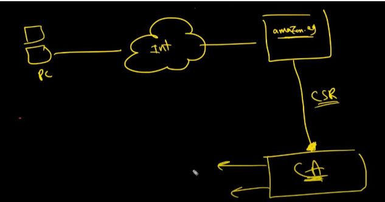
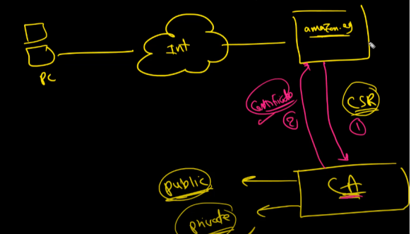
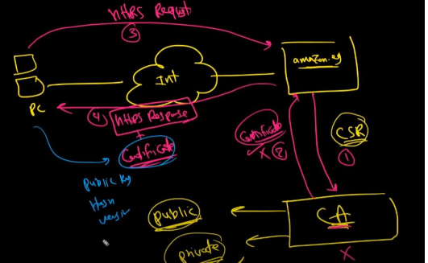

## _Apache Basics_
#### *1-main configration*
- install the httpd package in ubuntu (apache2).
- enable and start the service.
- add service to firewall.
- open config file `/etc/httpd/conf/httpd.conf`.
- to enable user serve his files form his home directory uncomment `UserDir public_html`,remove disabled.
    - if you want detect user replace (*) with user name in `<Directory /home/*/public_html>` in 
    this file `/etc/httpd/conf.d/userdir.conf`
- to be profficinal seprate the conf files and if you want add configration create file with extend **.conf** in this directory `/etc/httpd/conf/conf.d/`.
##### 2-Virtual Host configration
- to make apache serve more than website, you should apply **Virtual Host** concept.
    - create file as 01-Vhost.conf
    - set the configration of vhost.
    ````c
    <VirtualHost _default_:80>

    ServerName    www.website.com
    ServerAlias   website.com
    Customlog    "logs/defualt-logs.log" combined
    DocumentRoot /srv/main/www

    </VirtualHost>
    // to give permmision to make apace serve files form this directory 
    <Directory /srv/main/www>

    require all granted

    </Directory>
    ````
    - \_default\_ = (*) this option make the apache override the main server.
    - by defualt appace denied all Directory excpt Dir that I set in configration.
----
###### 3-TLS connection 
* Transport Layer Security (TLS).
* Because earlier versions of TLS were called the Secure Sockets Layer (SSL), 
* The TLS protocol, the successor of the secure socket layer (SSL) protocol, 
* protects data using encryption. When users send their information to a 
    website, TLS encrypts it before sending it.
    Then, only the server with the same public key as the client can open the message.
    This rule also applies when the server sends information back to the client.
    Only the client with thecorresponding key can read the data.
    For a website to use TLS protocol, you must install a valid TLS/SSL certificate
    (often called an SSL certificate).

* the certificate is a data file that contains the website’s identity and the 
 public key for opening payload messages.
* An SSL certificate must be valid to work. This means that not only must a 
    credible certificate authority (CA) sign it, but the certificate also must be 
    active. Every certificate has an issuance date and an expiration date. A 
    certificate is no longer valid after its expiration date
* _when you connect to the server you use http protocol,and this make datatransfare is clear text over the network_.
* https is (http + TLS).
* _to create a secure connection between two machines (clinet,server)use Deffie Helman algorithm to create_
  - public key (shared key).
  - private key (secret key).
  
* _each machine create Pub key, private key to use them in encrypt and decrept the data_.
>lets set the configration of TLS:
  * install crypto-utils package to use it in create the keys.
  * install SSL package.
  * `genkey serverName`
    * will use graphicl interface to detect key size and others requirments
  
__each website I serve must have Pub key and private key__
``````c
// make website use https
VirtualHost _default_:443>

    ServerName    www.website.com
    ServerAlias   website.com
    Customlog    "logs/defualt-logs-ssl.log" combined
    SSLEngine    on
    SSLCertificateFile /etc/pki/tls/certs/websitename.crt
    SSLCertificateKeyFile /etc/pki/tls/private/websitename.key
    DocumentRoot /srv/main/www

    </VirtualHost>
``````
__steps of sign the certificate :__
1-*website send requet CSR (certificate signed request) to CA*.


2-*CA reply with signed cirtificate.*

3-*pc send request and website reply with response+certificate.*

##### 4-secure directory
if you want a spesific user access your dirctory, you should make it secure,
anyone want to access you direcory must login with username and password.

###### 1st way 
>_stpes_
1-select the dir you want secure
2-change own to apache:apache _(user:group)_
3-create password for user `htpasswd -c /etc/httpd/conf/htpasswd username`

``````c
// make website use https
<VirtualHost _default_:443>

    ServerName    www.website.com
    ServerAlias   website.com
    Customlog    "logs/defualt-logs-ssl.log" combined
    
</VirtualHost>
<Directory /srv/main/www/secure-dir>
Require all granted
AuthType Basic
AuthName "please provide username and password ....."
AuthUserFile /etc/httpd/conf/htpasswd
Require Vaild-user
</Directory>

``````
###### 2nd way
>_steps_
1-create file with name `.htaccess` in the dir you want secure it.
2-write configration in `.htaccess`

``````bash
AuthType Basic
AuthName "please provide username and password ....."
AuthUserFile /etc/httpd/conf/htpasswd
Require Vaild-user
``````
##### 5-install mod_security
this package is responsible of secure your data from anyone may send sql commands,
prevent any one hasn't access to access this data.

_steps_
* install mod_security package
* install mod_security_crs(version). ***core rule set package***.
* restart httpd service.

----------


